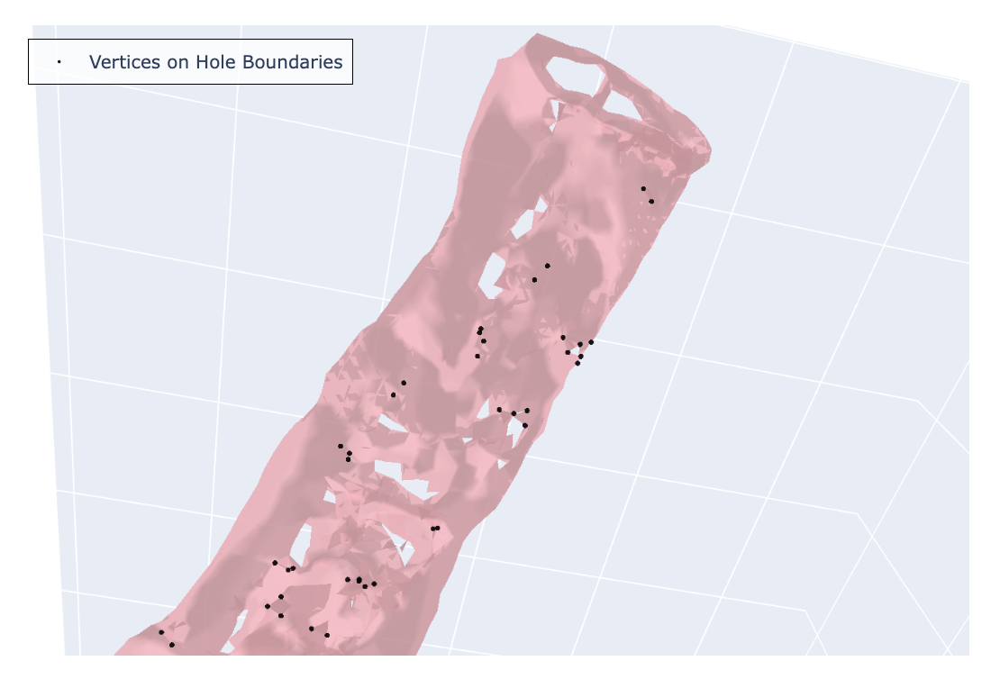
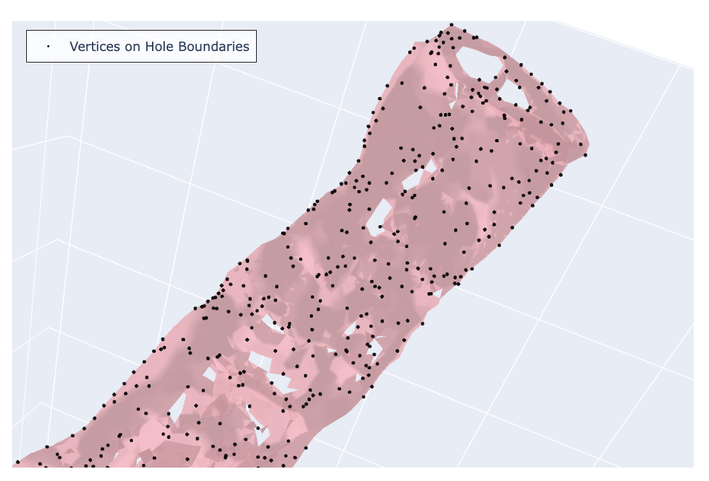

```python
# Import required libraries
import numpy as np

```


```python
# Import functions from your Python scripts
import sys
import os

# Add the current directory to Python path so we can import from local modules
sys.path.append('.')

# Import methods for bounding holes from detect_holes/ module
from hole_detectors.edge_based import bound_holes_edge_based
from hole_detectors.pca_based import bound_holes_pca_based
from hole_detectors.util import read_dotobj

```


```python
# Specify the path to the OBJ file
obj_filepath = './garment_models/6000_vertices.obj'  # Update this path as needed
```


```python
# Load the 3D model
print(f"Loading model from: {obj_filepath}")

# Read the OBJ file
dot_obj = read_dotobj(obj_filepath)
vertices = np.array(dot_obj['v'])
faces = dot_obj['f']

print(f"Loaded {len(vertices)} vertices and {len(faces)} faces")
print(f"Vertex coordinates range:")
print(f"  X: [{vertices[:, 0].min():.3f}, {vertices[:, 0].max():.3f}]")
print(f"  Y: [{vertices[:, 1].min():.3f}, {vertices[:, 1].max():.3f}]")
print(f"  Z: [{vertices[:, 2].min():.3f}, {vertices[:, 2].max():.3f}]")

```

    Loading model from: ./garment_models/6000_vertices.obj
    Loaded 6971 vertices and 14252 faces
    Vertex coordinates range:
      X: [-0.245, 0.211]
      Y: [-0.354, 0.195]
      Z: [-0.361, 0.378]


# Two Methods for Bounding Holes on a 3D Blender Model

The OBJ file specifies the vertices, edges, faces, face normals, and texture mappings of a 3D model. This notebook demonstrates two prototyped algorithms for finding vertices on the boundary of holes in a malformed 3D model generated from the Neural Radiance Field algorithm.

## Method 1: PCA-based
The big idea is to "flatten" the 3D model into 2D points through principal component analysis (PCA), then iterate through the vertices and look at the 360-degree radial neighborhood centered at each vertex. We assume that vertices on hole boundaries will have more "empty" neighborhoods and vice versa. Vertices on the silhouette will have "emptier" neighborhoods, so we ignore them in this process to avoid falsely flagging them. 

1. Use PCA to reduce the dimensionality of the 3D model. Since we're working with 3D models of garments, we assume that the first two principal components (PCs) can capture a majority of the variation in the 3D coordinates, so we can "flatten" the model from three dimensions to two by taking the first two PCs without losing much information.
<div>
    
</div>

2. We compute the alpha shape of the 2D projection. As the alpha parameter approaches infinity, the alpha shape approaches the convex hull, which is essentially a silhouette of the flattened model. We use this silhouette to filter out points on the outer boundary, which could otherwise be mistaken for hole-boundary points.
<div>
    
</div>

3. Put the 2D points into a KD-tree for efficient access of neighboring points in a fixed-radius neighborhood.
4. For each `point` in the set of 2D points, find all points in its fixed-radius neighborhood. Imagine overlaying a coordinate grid over `point` with `point` as the origin. Then, divide the 360° neighborhood into 36 angular sectors of 10° each. If more than `threshold` consecutive sectors are empty of neighbors, we flag point as a boundary candidate and stores its _sindex_.
<div>
    
</div>

5. Using _indices_ of the 2D points (PCs) flagged in step 4, retrieve their corresponding 3D PCs. Then, apply the inverse PCA transformation on the 3D PCs to map them back to the original vertex coordinates.


```python
print("Finding vertices on the boundary of holes using PCA-based method...")

boundary_vertices= bound_holes_pca_based(obj_filepath)
print(f"PCA-based method found {len(boundary_vertices)} boundary vertices")

# Convert to numpy array for easier indexing
boundary_indices = list(boundary_vertices)
boundary_coords = vertices[boundary_indices]

print(f"Percentage of vertices on hole boundaries: {len(boundary_vertices) / len(vertices) * 100:.2f}%")

```

    Finding vertices on the boundary of holes using PCA-based method...
    Percentage of variation explained: [0.82184634 0.15775511 0.02039855]


    6971it [00:01, 6767.07it/s]


    PCA-based method found 1481 boundary vertices
    Percentage of vertices on hole boundaries: 21.25%


### Explore interactive plot of 3D mesh and boundary vertices [here](./assets/PCA_based_demo.html).

## Method 2: Edge-based
<div>
    
</div>

This algorithm finds vertices on hole boundaries by examining the continuity of faces. 
For each edge, we look at the number of faces that it belongs to. 
If it is shared between two faces, then the mesh surface is continuous at this edge. Otherwise, the vertices on the edge are marked as boundary vertices.


```python
print("Finding vertices on the boundary of holes using edge-based method...")

boundary_vertices= bound_holes_edge_based(obj_filepath)
print(f"Edge-based method found {len(boundary_vertices)} boundary vertices")

# Convert to numpy array for easier indexing
boundary_indices = list(boundary_vertices)
boundary_coords = vertices[boundary_indices]

print(f"Percentage of vertices on hole boundaries: {len(boundary_vertices) / len(vertices) * 100:.2f}%")

```

    Finding vertices on the boundary of holes using edge-based method...
    Edge-based method found 133 boundary vertices
    Percentage of vertices on hole boundaries: 1.91%


### Explore interactive plot of 3D mesh and boundary vertices [here](./assets/Edge_based_demo.html).

# Comparison of the Two Methods
<div style="display: flex; justify-content: space-around; align-items: center;">
    <div style="text-align: center;">
        <h3>Edge-based Method</h3>
        
    </div>
    <div style="text-align: center;">
        <h3>PCA-based Method</h3>
        
    </div>
</div>

The panel above is a side-by-side comparison of the boundary vertices identified by the edge-baesd method and PCA-based method. From visually inspecting the images, we see that the two methods complement each other. The PCA-based method is more effective at bounding "donut-shaped" holes than the edge-based method. We use the term ‘donut-shaped’ hole to describe a torus-like structure: the garment mesh has an opening on the front and a corresponding opening on the back, and these are connected through the thickness of the material. The edge-based method struggles with this kind of holes because the surface remains continuous around the hole. However, the PCA-based method has substantially more false positives. 

While the edge-based method excels at detecting simple discontinuities, it misses donut-shaped holes; conversely, the PCA-based method can capture these structures but introduces more false positives. Together, they highlight different types of boundary behavior.
